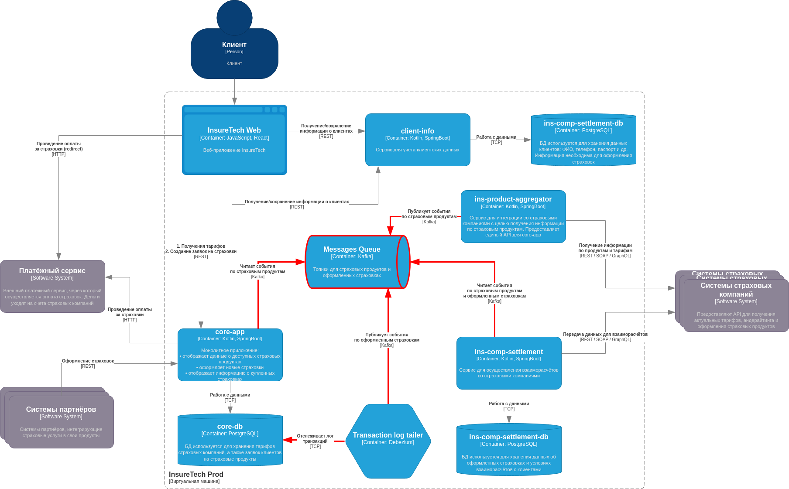

# Задание 3. Переход на Event-Driven архитектуру

Сервисы `core-app` и `ins-comp-settlement` получают данные о доступных продуктах через REST API сервиса `ins-product-aggregator`. В момент вызова он: запрашивает информацию из всех страховых компаний (сейчас их пять), агрегирует её в единый список, возвращает этот список в рамках того же синхронного запроса.

Чтобы ускорить работу сервисов, при изначальном проектировании команда решила хранить локальные реплики данных о продуктах и тарифах в сервисах `core-app` и `ins-comp-settlement`.

Сервис `core-app` осуществляет запрос к `ins-product-aggregator` раз в 15 минут, а `ins-comp-settlement` — раз в сутки (ночью), при формировании реестра оформленных страховок. Иногда команда сталкивается с ошибками взаимодействия между этими сервисами. Они связаны с задержками ответов или ошибками при взаимодействии с API страховых компаний.

Дополнительно сервис `ins-comp-settlement` раз в сутки осуществляет запрос в `core-app` по REST API для получения всех оформленных за день страховок. Эти данные он использует. 

В ближайшее время InsureTech планирует подписать агентское соглашение ещё с пятью страховыми компаниями. Вам предстоит спроектировать решение, которое устранит текущие проблемы.

## Проблемы текущей архитектуры

1. Запрос информации из всех страховых компаний в рамках обработки синхронного запроса к REST API `ins-product-aggregator`: 
    - С подключением каждой новой страховой компаний будет увеличиваться время отклика сервиса.
    - Ошибки при взаимодействии с API страховых компаний негативно влияют на надежность сервиса.
2. Ошибки, либо временная недоступность сервиса при синхронной коммуникации между `ins-comp-settlement` и `core-app` в части загрзуки оформленных за день страховок приведет к нарушению процесса расчёта выплаты агентских премий.

## Event-Driven архитектура (TO-BE)

